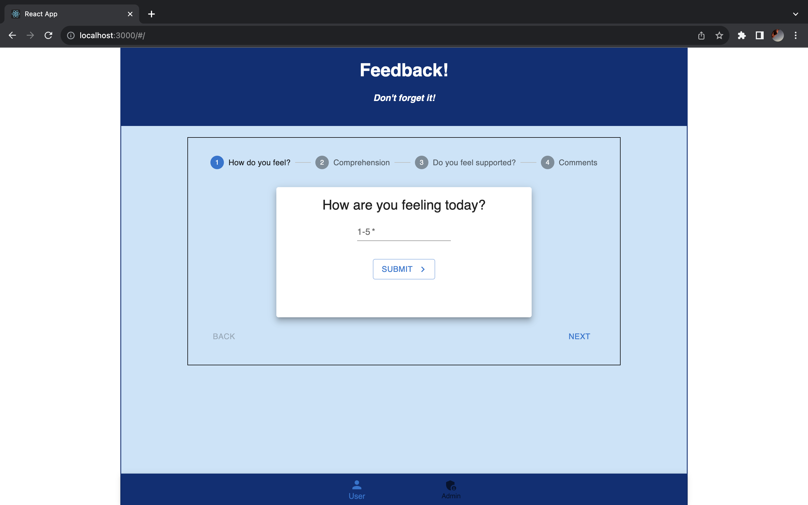

# Feedback Form

## Description

_Duration: Weekend Challenge_

This app is a daily feedback questionnaire for a student to fill out.

## Screen Shot

Screen shot of the first page in the feedback questionnaire:

### Prerequisites

- [Node.js](https://nodejs.org/en/)

## Installation

1. Create a database named `prime_feedback`,
2. The queries in the `data.sql` file are set up to create all the necessary tables and populate the needed data to allow the application to run correctly. The project is built on [Postgres](https://www.postgresql.org/download/), so you will need to make sure to have that installed. We recommend using Postico to run those queries as that was used to create the queries, 
3. Open up your editor of choice and run an `npm install`
4. Run `npm run server` in your terminal
5. In another terminal run `npm run client` 
6. The `npm run client` command will open up a new browser tab for you!

## Usage
How does someone use this application? Tell a user story here.

1. Users are taken to the first page of the survey upon load. 
2. They have a stepper with 4 questions to respond to.
3. Once they have have answered all 4 questions they can review and then submit their feedback, as well as click on a button to fill out an additional survey.
4. There is also an admin page that you can navigate to with a button on a bottom nav bar (in the future this page would be log in protected.)
5. On the admin page you can see a list of all entries in the database, and can delete and flag those entries.

## Built With

- Javascript
- React
- Node.js
- Redux
- Express 
- Material UI
- Postgresql

## Acknowledgement
Thanks to [Prime Digital Academy](www.primeacademy.io) who equipped and helped me to make this application a reality. 